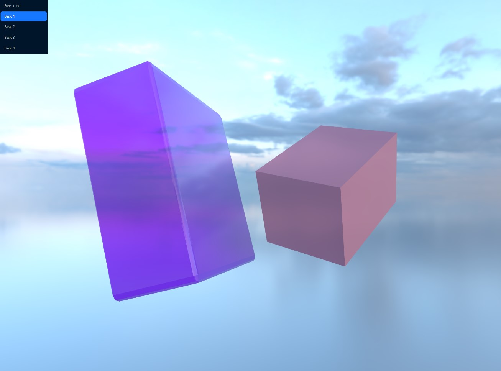
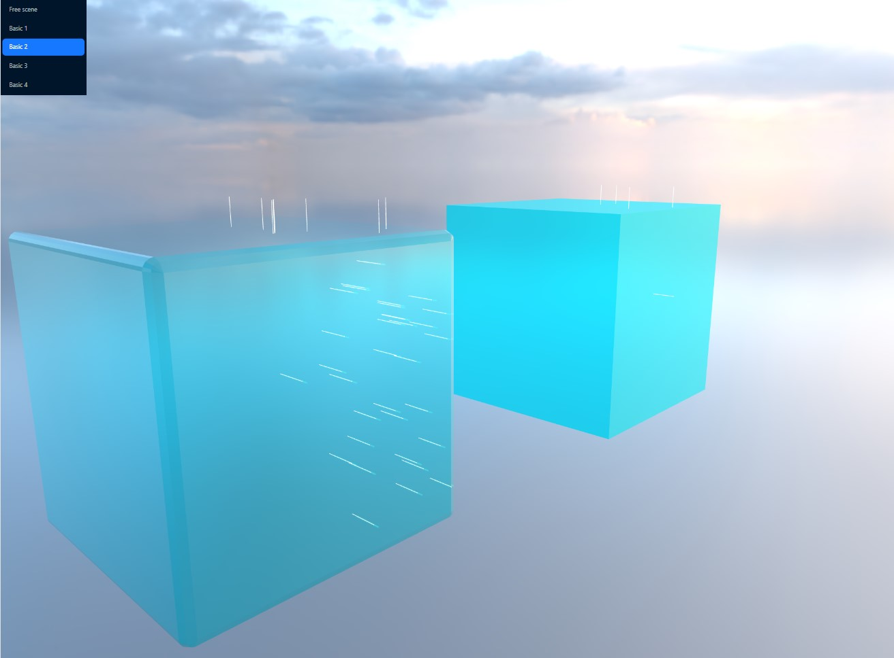
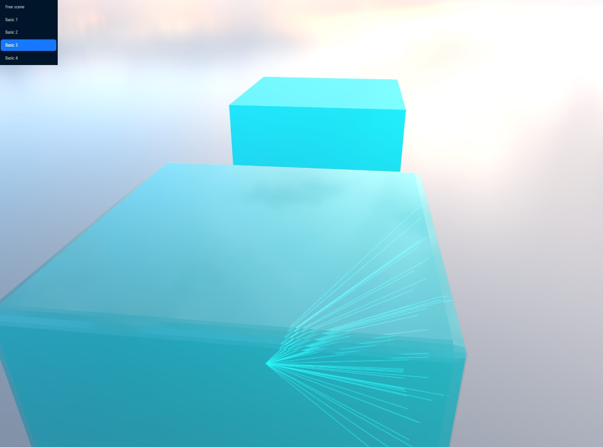

gh-pages: https://anastasy-ya.github.io/three_js_examples/

## Стек: React, Three.js, ant design

## Что сделано:
Для оптимизации ресурсов сцена генерируется один раз, 
объекты и функции для каждого пункта меню загружаются динамически.

1) Создать сцену с 2 кубами, при клике на любой куб рандомно менять ему размер, поворот, цвет материала.
2) Создать сцену с 2 кубами, при клике на любой куб добавить на сцену линию пересекающую куб в точке клика.
3) Создать сцену с 2 кубами, при клике на любой куб добавить на сцену линию пересекающую куб в точке клика, центры геометрий кубов.
4) Создать сцену с 2 кубами, при клике на любой куб сделать все стороны второго куба равными расстоянию от точки клика до центра геометрии куба по которому кликнули.

4 пункт требует доработки: функция changeSizeAsDistance производит все необходимые расчеты 
и возвращает измененный массив мешей. Их необходимо встроить в сцену. Параметры измененных кубов выведены в консоль.

 

 

